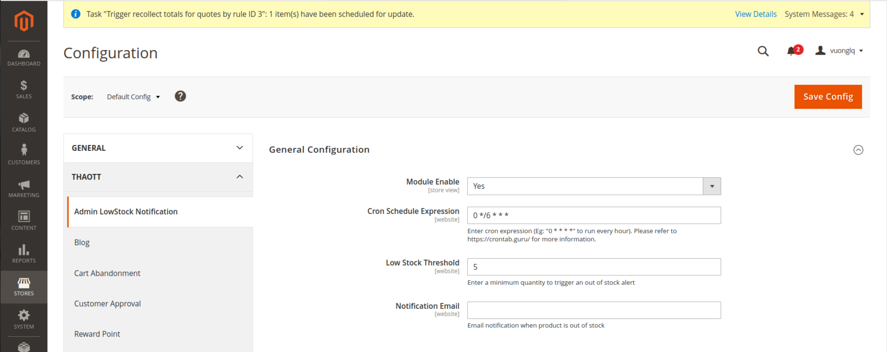
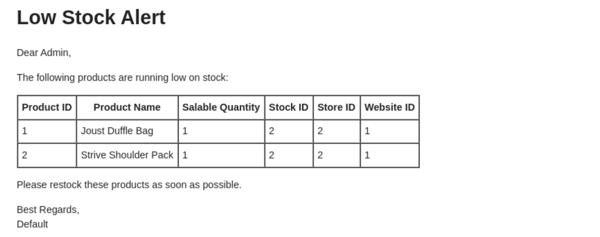

# Thao_AdminLowStockNotification

Magento 2 module for sending notifications when product stock is low.

## System Requirements

- Magento 2.4+
- PHP 7.4+

## Installation

### Install via Composer

1. Add the repository to Composer:
   ```sh
   composer config repositories.thao/module-admin-low-stock-notification git https://github.com/Tothao/Thao_AdminLowStockNotification.git
   ```
2. Install the module:
   ```sh
   composer require thao/module-admin-low-stock-notification:dev-master
   ```
3. Run the following commands to enable the module:
   ```sh
   php bin/magento setup:upgrade
   php bin/magento setup:di:compile
   php bin/magento cache:flush
   ```

### Manual Installation

1. Clone the module from GitHub:
   ```sh
   git clone https://github.com/Tothao/Thao_AdminLowStockNotification.git app/code/Thao/AdminLowStockNotification
   ```
2. Run the following commands to enable the module:
   ```sh
   php bin/magento setup:upgrade
   php bin/magento setup:di:compile
   php bin/magento cache:flush
   ```
## Configuration Guide

To configure the module, go to **Admin > Configuration > Thaott > Admin LowStock Notification > General Configuration**.

### Use guide:

- **Module Enable:** Enable/disable the module.
- **Cron Schedule Expression:** Enter a cron expression to schedule low stock alerts. Example: `0 * * * *` runs every hour. Refer to [crontab.guru](https://crontab.guru/) for more details.
- **Low Stock Threshold:** Set the minimum quantity to trigger an out-of-stock alert.
- **Notification Email:** Specify the email address to receive low stock notifications.



Additionally, you can run the following command to send the email immediately.
   ```sh
   php bin/magento lowstock:send
   ```
Reiveiced email



## Support

If you encounter any issues or have questions, please create an issue on the module's GitHub repository.

## License

This module is released under the MIT license.
